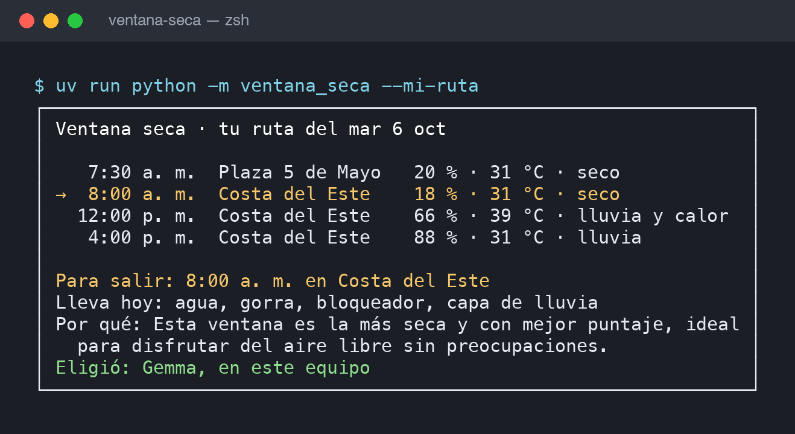

# Ventana seca

En octubre llueve en Ciudad de Panamá casi todas las tardes. **Ventana seca** mira el pronóstico por hora de los próximos días, calcula los tramos de luz con menos lluvia, calor y sol fuerte para salir a caminar o correr, y deja que **Gemma**, un modelo de pesos abiertos que corre en tu propio equipo con Ollama, escoja uno según lo que tú le pidas. El resultado es una tarjeta de un vistazo y un recordatorio en el calendario que avisa media hora antes, para que guardes el teléfono y salgas.

> **In English.** *Ventana seca* ("dry window") finds the best rain-free window to go outside in Panama City during the rainy season. It scores hourly forecasts from Open-Meteo, lets Google's open-weight **Gemma** model, running locally through Ollama, pick one of those windows based on what you ask for in plain words, and writes a one-glance card plus a calendar reminder. Built for the DEV Hacktoberfest Open-Source AI Challenge, Week 1: *Touch Grass*.

```text
┌──────────────────────────────────────────────────────────────┐
│ Ventana seca · Parque Natural Metropolitano                  │
│ Mié 7 oct · 6:00 p. m. – 7:00 p. m.                          │
│ Lluvia: hasta 53 % (0,0 mm) · Sensación: 33 °C · UV: 0       │
│ Lleva: agua, gorra, repelente, capa de lluvia, linterna      │
│ Por qué: Esta ventana tiene poca probabilidad de lluvia y es │
│   después de las 6 de la tarde, justo lo que buscas.         │
│ Ojo: no es una ventana seca de verdad (53 % de lluvia).      │
│ Eligió: Gemma, en este equipo                                │
└──────────────────────────────────────────────────────────────┘
```

Salida real del 6 oct con `--preferencia "después del trabajo, no antes de las 4 de la tarde"`. Gemma respetó el horario, pero llamó «poca probabilidad» a un 53 %; la línea **Ojo** la agrega el código justamente para eso.

## Demo



[Video de 31 segundos](demo/ventana-seca-demo.mp4) con las tres escenas. Más detalles en [`demo/`](demo/README.md).

## Tu ruta diaria

No todo el mundo tiene una mañana libre para un sendero. Muchas veces la salida posible es la de siempre: el tramo a pie al metro, el almuerzo, la vuelta a casa. Con `--ruta` le das tus paradas fijas y Ventana seca te dice cómo estará cada una y en cuál conviene pasar un rato afuera:

```sh
uv run python -m ventana_seca \
  --ruta "7:30 5 de mayo, 8:00 costa del este, 12 pm costa del este, 4 pm costa del este" \
  --preferencia "quiero caminar un rato en la hora del almuerzo"
```

```text
┌─────────────────────────────────────────────────────────────────┐
│ Ventana seca · tu ruta del mar 6 oct                            │
│                                                                 │
│    7:30 a. m.  Plaza 5 de Mayo   20 % · 31 °C · seco            │
│    8:00 a. m.  Costa del Este    18 % · 31 °C · seco            │
│ → 12:00 p. m.  Costa del Este    66 % · 39 °C · lluvia y calor  │
│    4:00 p. m.  Costa del Este    88 % · 31 °C · lluvia          │
│                                                                 │
│ Para salir: 12:00 p. m. en Costa del Este                       │
│ Lleva hoy: agua, gorra, bloqueador, capa de lluvia, zapatos con │
│   agarre                                                        │
│ Por qué: Aunque hay mucha lluvia, esta ventana te da un rato    │
│   para caminar. Prepárate para estar muy húmedo y caluroso.     │
│ Ojo: no es una ventana seca de verdad (66 % de lluvia).         │
│ Eligió: Gemma, en este equipo                                   │
└─────────────────────────────────────────────────────────────────┘
```

La ruta se guarda en `datos/ruta.txt`; los días siguientes basta con `uv run python -m ventana_seca --mi-ruta`. Lo que hay que llevar se calcula para todo el día: si a las 4 p. m. llueve, la capa sale contigo desde la mañana. Las horas se escriben como `7:30`, `16:00`, `4 pm` o `12 pm`.

## Cómo funciona

1. **Pronóstico.** Pide a [Open-Meteo](https://open-meteo.com/) la probabilidad de lluvia, los milímetros, la sensación térmica, el índice UV y si es de día, hora por hora. Lo pide para las coordenadas del **parque**, no para las tuyas: tu ubicación no sale del equipo. Guarda una copia en `datos/` para usarla sin señal.
2. **Ventanas.** El código, sin IA, recorre las horas de luz y puntúa cada tramo: castiga la lluvia, la sensación por encima de 32 °C y el UV por encima de 7. Se queda con hasta cinco ventanas, dos por día como máximo y separadas al menos tres horas, para que haya opciones reales (mañana o tarde), y las nombra con letras.
3. **Elección.** Gemma recibe esas ventanas, o las paradas de tu ruta, y tu preferencia escrita (*«temprano, voy con mi hija de 6 años»*) y responde con un JSON restringido: solo puede devolver la etiqueta de una ventana existente (*«mar 6 oct, 12:00 p. m. en Costa del Este»*) y objetos de una lista cerrada. Si pediste una hora y existe, la respeta aunque no sea la más seca, y te advierte. Si devuelve otra cosa o Ollama no está corriendo, decide la regla fija: la de mayor puntaje. El modo de razonamiento de Gemma 4 va apagado: para escoger entre cinco letras no hace falta, y así la respuesta baja de 40–110 a unos 8 segundos en una MacBook con 8 GB de RAM.
4. **Lo imprescindible.** Agua siempre; capa si la lluvia llega al 30 %; gorra y bloqueador con UV de 6 o más; repelente en los senderos de bosque; linterna si la ventana toca la oscuridad. Esto lo añade el código, diga lo que diga el modelo.
5. **Salida.** Una tarjeta en la terminal y, si quieres, un archivo `.ics` con aviso 30 minutos antes.

Las cifras de la tarjeta siempre salen del pronóstico, nunca del modelo. Si la ventana elegida tiene puntaje bajo, la tarjeta lo advierte aunque el motivo del modelo suene optimista.

## Instalar

Requisitos: Python 3.11 o superior, [uv](https://docs.astral.sh/uv/) y, para la elección con IA, [Ollama](https://ollama.com/).

```sh
git clone https://github.com/yosef7/ventana-seca.git
cd ventana-seca
uv sync
ollama pull gemma4:e2b
```

`gemma4:e2b` (4,6 GB) es el Gemma 4 más pequeño y corre en una laptop de 8 GB de RAM. Sin Ollama, Ventana seca funciona igual con la regla fija.

## Usar

```sh
# La mejor ventana de 1 hora en el Parque Natural Metropolitano en los próximos 3 días
uv run python -m ventana_seca

# Dos horas en la Cinta Costera, con preferencia escrita y recordatorio de calendario
uv run python -m ventana_seca --lugar cinta-costera --duracion 2 \
  --preferencia "después del trabajo, no antes de las 4" --ics salir.ics

# Ver todas las candidatas y cuál se eligió
uv run python -m ventana_seca --ventanas

# En el sendero, sin señal: usa la última copia guardada
uv run python -m ventana_seca --sin-conexion
```

| Opción | Qué hace |
| --- | --- |
| `--lugar` | `metropolitano` (por defecto), `camino-de-cruces`, `ancon`, `cinta-costera`, `amador`, `5-de-mayo` o `costa-del-este` |
| `--ruta PARADAS` | Tus paradas del día, separadas por comas; se guardan |
| `--mi-ruta` | Usa la última ruta guardada |
| `--duracion` | Horas afuera, de 1 a 4; en una ruta, lo que dura cada parada |
| `--dias` | Días que se miran, de 1 a 7 |
| `--preferencia` | Lo que prefieres, en tus palabras |
| `--ics ARCHIVO` | Guarda un evento con aviso 30 minutos antes |
| `--sin-conexion` | Usa el último pronóstico guardado |
| `--sin-ia` | Elige con la regla fija |
| `--modelo` | Otro modelo de Ollama, por ejemplo `gemma4:e4b` |
| `--ventanas` | Muestra todas las candidatas |

## Pruebas

```sh
uv run pytest
```

Cubren el cálculo de ventanas con un día típico de octubre (mañana seca, aguacero a las 2 de la tarde), que Gemma no pueda inventar ventanas ni objetos, la caída a la regla fija sin Ollama, el aviso cuando la ventana no es seca, la lectura de rutas, el calendario en UTC y el uso sin señal.

## Límites

- Las coordenadas de los lugares son aproximadas. Para el pronóstico basta, porque la malla del modelo meteorológico es más gruesa que un parque.
- Un pronóstico de lluvia tropical es incierto: una ventana con 20 % puede mojarte. La tarjeta dice la cifra para que decidas tú.
- Ventana seca no conoce cierres de senderos ni horarios de los parques.

## Documentación

| Documento | Qué contiene |
| --- | --- |
| [Arquitectura y decisiones](docs/arquitectura.md) | Flujo, módulos, puntaje, decisiones de diseño y por qué abierto |
| [Validación](docs/validacion.md) | Pruebas automáticas, ejecuciones reales con Gemma y la prueba afuera en una ruta diaria |
| [Demo](demo/README.md) | Salidas reales del 6 oct, imágenes y video, y cómo regenerarlos |

## Licencia

Código bajo [MIT](LICENSE). Gemma 4 se distribuye bajo Apache 2.0, según la licencia que muestra `ollama show gemma4:e2b --license`. Los datos del pronóstico son de [Open-Meteo](https://open-meteo.com/), con licencia CC BY 4.0.
