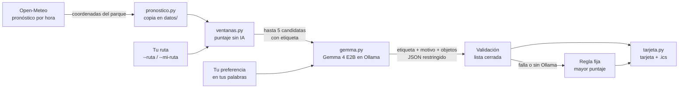

# Arquitectura y decisiones

[Inicio](../README.md) · [Validación](validacion.md)

Ventana seca separa lo que se puede **calcular** de lo que hay que **interpretar**. Los números (lluvia, calor, UV, horas de luz) los procesa código determinista. El modelo de lenguaje solo interpreta lo que la persona escribe en sus palabras y escoge entre opciones ya calculadas.

## Módulos

| Archivo | Responsabilidad |
| --- | --- |
| [`lugares.py`](../ventana_seca/lugares.py) | Siete lugares públicos con coordenadas aproximadas y búsqueda por clave o nombre |
| [`pronostico.py`](../ventana_seca/pronostico.py) | Descarga de Open-Meteo, copia local en `datos/` y lectura prudente de datos faltantes |
| [`ventanas.py`](../ventana_seca/ventanas.py) | Puntaje de cada tramo, selección de candidatas y puntaje de las paradas de una ruta |
| [`ruta.py`](../ventana_seca/ruta.py) | Lectura de la ruta escrita a mano y elección del día (hoy o mañana) |
| [`gemma.py`](../ventana_seca/gemma.py) | Pedido a Ollama, validación de la respuesta, regla fija y objetos imprescindibles |
| [`tarjeta.py`](../ventana_seca/tarjeta.py) | Tarjeta de texto, tarjeta de ruta y evento de calendario `.ics` |
| [`__main__.py`](../ventana_seca/__main__.py) | Línea de comandos: modo lugar y modo ruta |

## Puntaje

Cada tramo parte de 100 puntos y se le resta:

| Castigo | Por qué |
| --- | --- |
| La probabilidad máxima de lluvia, punto por punto | Es lo que más arruina una salida en octubre |
| 15 por cada milímetro previsto | Distingue una llovizna probable de un aguacero |
| 4 por cada grado de sensación térmica por encima de 32 °C | A mediodía en Panamá la sensación pasa de 35 °C con facilidad |
| 3 por cada punto de UV por encima de 7 | El sol de mediodía también es un riesgo |

Una ventana con 60 puntos o más se considera **buena**. Por debajo, la tarjeta muestra el aviso «Ojo».

## Decisiones

| Decisión | Motivo |
| --- | --- |
| **El pronóstico se pide para el lugar, no para la persona** | Las coordenadas de un parque no dicen nada de quien sale. No se usa GPS ni se envía la ubicación real a ningún servidor |
| **Copia local del pronóstico** | En el sendero puede no haber señal. Con `--sin-conexion`, o si la descarga falla, se usa la última copia y la tarjeta dice cuándo se guardó y por qué no hubo descarga |
| **El código calcula y el modelo elige** | Un modelo pequeño puede equivocarse con números. Así, toda cifra de la tarjeta viene del pronóstico |
| **JSON restringido con `format`** | Ollama obliga a Gemma a responder con un esquema cuyo campo `ventana` solo admite las etiquetas existentes y cuyo campo `llevar` solo admite objetos de la lista |
| **Etiquetas legibles en vez de letras** | Con letras, Gemma escribía «la opción B» en su explicación, una referencia que la tarjeta no muestra. Con etiquetas como «mar 6 oct, 12:00 p. m. en Costa del Este» no hay código interno que filtrar |
| **Regla fija como respaldo** | Sin Ollama, con una respuesta inválida o con `--sin-ia`, se elige la ventana de mayor puntaje. La herramienta siempre responde |
| **Objetos imprescindibles fuera del modelo** | Agua siempre; capa con 30 % de lluvia o más; gorra y bloqueador con UV de 6 o más; repelente en bosque; linterna si la ventana toca la oscuridad. En una ruta se calculan para todo el día |
| **Aviso «Ojo» generado por el código** | En las pruebas, Gemma llamó «poca probabilidad» a un 53 % de lluvia. El aviso no depende de lo que diga el modelo |
| **Razonamiento de Gemma 4 apagado (`think: false`)** | Para escoger entre cinco opciones no hace falta. La respuesta bajó de 40–110 s a unos 8 s en una MacBook con 8 GB de RAM |
| **Ventanas del mismo día separadas por 3 horas** | Sin separación salían 7:00–8:00 y 8:00–9:00, que no son opciones distintas |
| **Modo ruta** | Muchas personas no tienen una mañana libre para un sendero: su salida posible es el tramo al metro, el almuerzo o la vuelta a casa. La ruta se guarda en `datos/ruta.txt` para no escribirla cada día |
| **Recordatorio `.ics` con aviso 30 minutos antes** | El reto pide que la pantalla sea la parte más corta de la experiencia: se mira la tarjeta una vez y el teléfono avisa |
| **Solo biblioteca estándar de Python** | Cero dependencias de ejecución; solo `pytest` para las pruebas |

## Por qué abierto

- **Gemma 4 E2B corre en el equipo.** Lo que la persona escribe sobre su día («voy con mi hija», «salgo a las 4») no sale de su computadora.
- **No cuesta nada por consulta.** Se puede ejecutar cada mañana sin clave de API ni cuota.
- **Se puede cambiar el modelo** con `--modelo`, por ejemplo a `gemma4:e4b` en un equipo con más memoria.
- **Open-Meteo es abierto** y no pide clave; sus datos se publican con licencia CC BY 4.0.

## Límites conocidos

- Las coordenadas son aproximadas; la malla del modelo meteorológico es más gruesa que un parque.
- La lluvia tropical es difícil de pronosticar por hora. La tarjeta da la cifra para que la persona decida.
- No conoce cierres de senderos, horarios de parques ni el tráfico.
- La duración de la ventana se mide en horas enteras.
